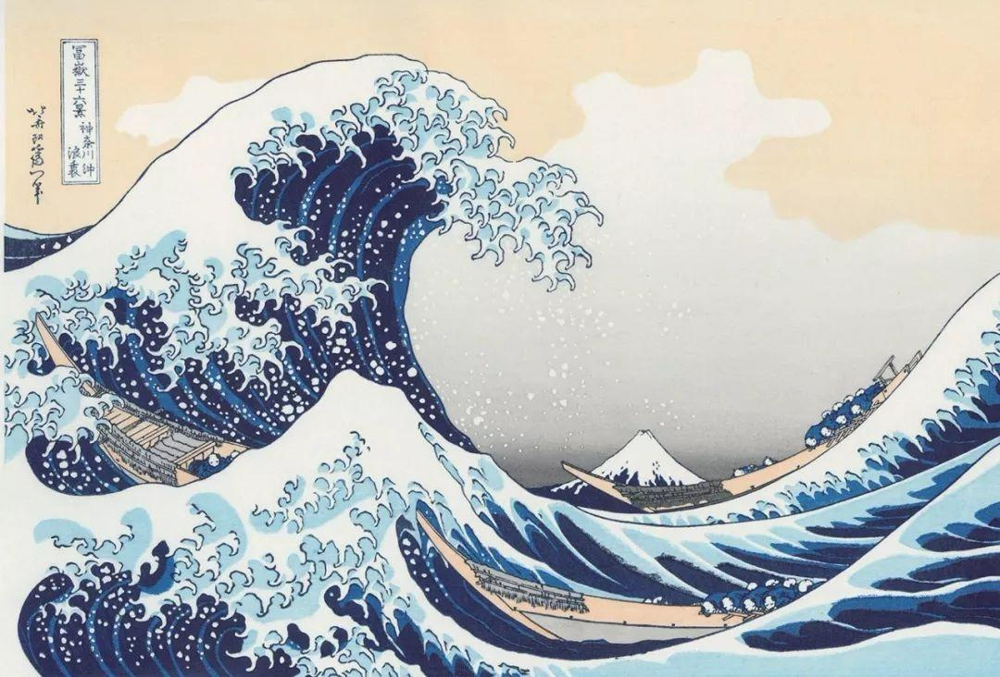

# seam-carving实验报告
隋唯一  2017011430

## 运行方式
### 命令行模式
运行main.py即可。根据命令行提示输入待压缩图片名，目标宽度，目标高度。
```bash
>>>Please enter the name of source image:destroyer.jpg
>>>Please enter the width of target image:1000
>>>Please enter the height of target image:800
```
程序会读取data文件夹下的图片，将压缩后的同名图片存储到output文件夹下。

### gui模式
运行gui.py即可。根据ui提示输入待压缩图片名，目标宽度，目标高度。（与命令行的输入完全相同）。
点击“确认”按钮，即可开始计算。
程序会将原图片与压缩后图片显示在gui界面上，并将压缩后的同名图片存储到output文件夹下。

## 代码结构
main.py: 读取数据，处理删除细缝的数量
img_energy.py: 基于Sobel算子，计算图片矩阵每一像素能量
seam.py: 删除条横向或纵向缝隙

## 实验效果
### 横向压缩
压缩前：

压缩后：

注意，左上角的落款部分几乎没有压缩，说明文字类图片能量较高。

### 纵向压缩
压缩前：

压缩后：


### 双向压缩
压缩前：

压缩后：


### 处理较差的图片
压缩前：

压缩后：


处理较差的原因分析：
根据像素能量的计算公式，蒙娜丽莎胸前单色的皮肤的能量远远小于包含较多细节的背景。所以算法在应用的时候体现出保留背景而裁剪人像的趋势。

## 加分项
- GUI